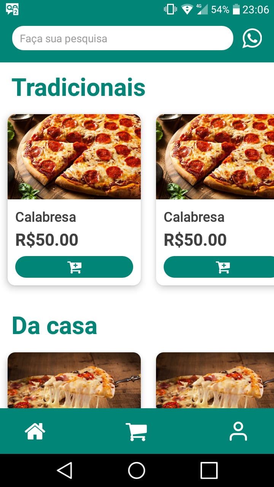
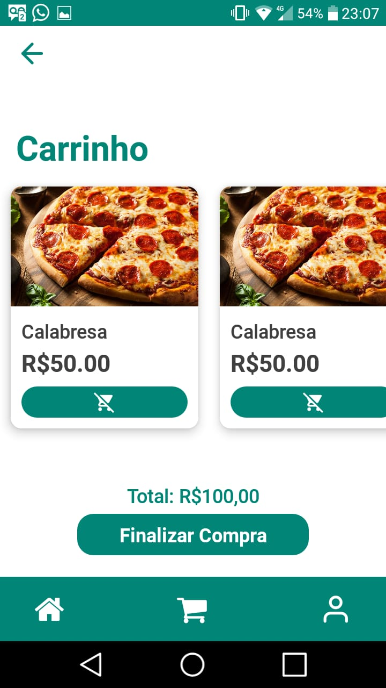
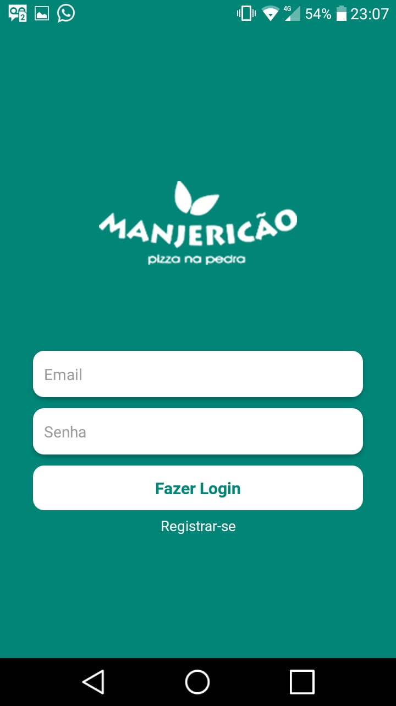

<p align="center">	
   <a href="https://www.linkedin.com/in/pablo-rosa-68136a1b2/">
      
   </a>
  


  <a href="https://github.com/PabloRSantos/Pizzaria_Mobile/commits/master">
    
</p>

# :pushpin: Índice

- [Sobre](#sobre)
- [Tecnologias Utilizadas](#tecnologias-utilizadas)
- [Como Usar](#como-usar)
- [Como Contribuir](#como-contribuir)

<a id="sobre"></a>

## :bookmark: Sobre

O <strong>Pizzaria Mobile</strong> é uma aplicação Mobile para clientes comprarem suas pizzas pelo mesmo


<a id="tecnologias-utilizadas"></a>

## :rocket: Tecnologias Utilizadas

O projeto foi desenvolvido utilizando as seguintes tecnologias

- [JavaScript](https://www.javascript.com/)
- [Node.js](https://nodejs.org/en/)
- [ReactJS](https://reactjs.org/)
- [React Native](https://reactnative.dev/)
- [Knex](http://knexjs.org)
- [Postgress](https://www.postgresql.org)


## :heavy_check_mark: :iphone: Resultado Mobile

<h1 align="center">
    
    
    
</h1>

 
<a id="como-usar"></a>

# :construction_worker: Como Usar

### **Pré-requisitos**

  - É **necessário** possuir o **[Node.js](https://nodejs.org/en/)** instalado na máquina
  - Também, é **preciso** ter um gerenciador de pacotes seja o **[NPM](https://www.npmjs.com/)** ou **[Yarn](https://yarnpkg.com/)**.
  - Por fim, é **essencial** ter o **[React Native](https://reactnative.dev)** instalado de forma global na máquina

```bash
# Clone o Repositório
$ git clone https://github.com/PabloRSantos/Pizzaria_Mobile.git
```
### 📦 Executando API

```bash
# Entre na pasta server
$ cd Pizzaria_Mobile/server

# Instale as dependências
$ yarn install ou npm install

# Execute a aplicação
$ yarn dev ou npm run dev
```
Acesse a API em http://localhost:3333/

### 💻 Executando admin

```bash
# Entre na pasta admin
$ cd Pizzaria_Mobile/admin

# Instale as dependências
$ yarn install ou npm install

# Execute a aplicação
$ yarn start ou npm run start
```
Vá para http://localhost:3000/ para ver o resultado.

### 📱 Executando projeto mobile
Para executar o projeto mobile você precisa de um celular com o aplicativo [expo](https://play.google.com/store/apps/details?id=host.exp.exponent) instalado ou um emulador android/ios.
<br />

```bash
# Entre na pasta mobile
$ cd Pizzaria_Mobile/mobile

# Instale as dependências
$ yarn install ou npm install

# Inicie o react native
$ yarn start ou npm run start

```
Depois, caso seu ambiente não esteja pronto para rodar um app react native, [clique aqui](https://reactnative.dev/docs/environment-setup), senão, rode yarn/npm start android/ios no seu terminal
<a id="como-contribuir"></a>

## :recycle: Como contribuir

- Faça um Fork desse repositório,
- Crie uma branch com a sua feature: `git checkout -b my-feature`
- Commit suas mudanças: `git commit -m 'feat: My new feature'`
- Push a sua branch: `git push origin my-feature`


---

<h4 align="center">
    Feito com 💜 by <a href="https://www.linkedin.com/in/pablo-rosa-68136a1b2/" target="_blank">Pablo Rosa</a>
</h4>
